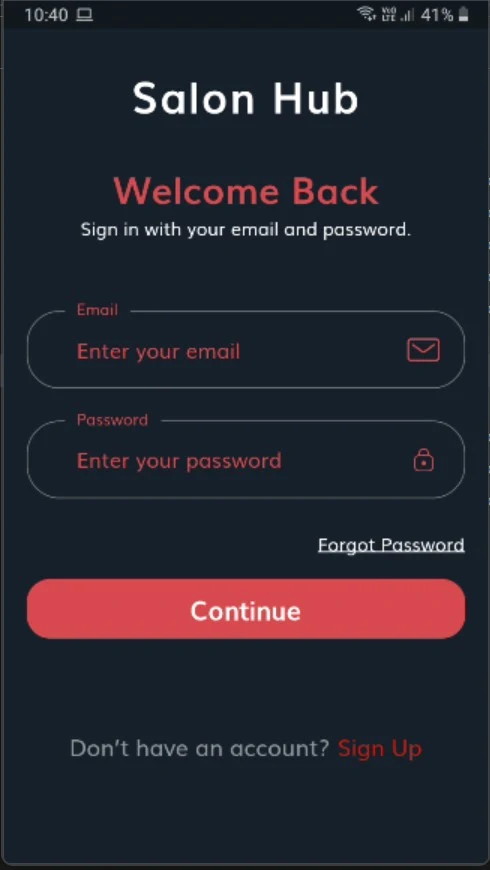

<p align="center">
  <a href="https://github.com/thisisNaman/Salon-Hub">
    
  </a>
</p>
<p align="center">
	 It is an e commerce application for buying salon based products. User can register as a salon or as a buyer according to which, the deals will be shown to him. After selecting the product, go to the cart page to show the summary of the items which the user has selected for buying. After that user can make payments using UPI, or any other online payment services.
</p>
<hr style="width:50%;text-align:left;margin-left:0">
<p align="center">
Show some love 💙 and Star ⭐️ the Repository to support the project.
</p>

|                 Sign in Screen                 |                 Sign up Screen                       |                    Home Page                |
|:-------------------------------------------------:|:-------------------------------------------------:|:-------------------------------------------------:|
|  |  |  |

## What’s In This Document

- [Get Up and Running in 5 Minutes](#rocket-get-up-and-running-in-5-minutes)
- [Flutter / Dart Packages Used](#ballot_box-flutter--dart-packages-used)
- [Project Video](#-project-video)
- [Thanks to Contributors and Sponsors](#blue_heart-thanks)

## :rocket: Get Up and Running in 5 Minutes

You can get the Salon Hub App up and running on your local dev environment in 5 minutes with these four steps:

1. **Install the Flutter SDK & Android Studio. [Instructions](https://medium.com/enappd/install-flutter-on-windows-and-mac-1fd1dde453ba).**

2. **Open Terminal & navigate to the root directory of the project.**

    ```shell
    cd salon-hub
    ```

3. **Run and launch the build on preferred device.**

   ```shell
   flutter run
   ```

4. **Open the source code and start editing!**

   Your app is now running on your physical device or emulator. Open the `lib` directory in Android Studio itself and edit `*.dart` files. Hot Reload your changes, and the app will update in real time!

At this point, you’ve got the fully functional Salon Hub App running (without the secret keys). For additional information on how you can customize your Flutter Apps, see [Google Codelabs](https://codelabs.developers.google.com/codelabs/flutter/) and [HackerNoon Guide](https://hackernoon.com/making-the-most-of-flutter-from-basics-to-customization-433171581d01).

## ▶ <a href="https://play.google.com/store/apps/details?id=com.mnapp.salon_hub">Play Store Link</a>

## :ballot_box: Flutter / Dart Packages Used
|    Package Name    	| Package Version 	|                           Package URL                          	|
|:------------------:	|:---------------:	|:--------------------------------------------------------------:	|
| firebase_core 	    |      latest     	| [Open on pub.dev](https://pub.dev/packages/firebase_core)          |
| firebase_auth	        |      latest     	| [Open on pub.dev](https://pub.dev/packages/firebase_auth)            |
| cloud_firestore     	|      latest     	| [Open on pub.dev](https://pub.dev/packages/cloud_firestore)         |
| google_fonts 	|      latest     	| [Open on pub.dev](https://pub.dev/packages/google_fonts) 	|
| http          	|      latest     	| [Open on pub.dev](https://pub.dev/packages/http)             |
| connectivity_plus     	|      latest     	| [Open on pub.dev](https://pub.dev/packages/connectivity_plus)             |
| flutter_staggered_grid_view          	|      latest     	| [Open on pub.dev](https://pub.dev/packages/flutter_staggered_grid_view)             |
| razorpay_flutter          	|      latest     	| [Open on pub.dev](https://pub.dev/packages/razorpay_flutter)             |
| sliding_up_panel          	|      latest     	| [Open on pub.dev](https://pub.dev/packages/sliding_up_panel)             |
| in_app_update          	|      latest     	| [Open on pub.dev](https://pub.dev/packages/in_app_update)             |


## :blue_heart: Thanks

Thanks to all contributors for supporting the project.
